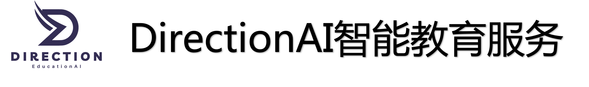
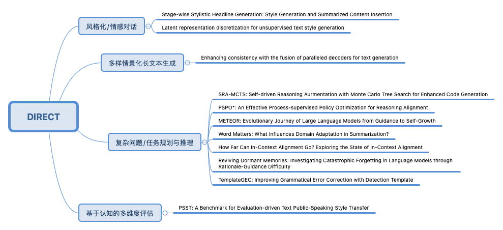

  <picture>
    
  </picture>

  🔅 <a href="./README_en.md" target="_blank">ENGLISH</a> &nbsp;| &nbsp;
  🌐 <a href="http://www.directionai.cn/" target="_blank">在线访问链接</a> &nbsp; | &nbsp;
  🔖 <a href="./Test_Account.md" target="_blank">获得测试账号</a> &nbsp;

***

👋 欢迎来到**DirectionAI教学实践平台**，体验您的智能教育助手。 👋 

  DirectionAI 面向高校、职教、企业培训等场景，提供基于最前沿AI技术的智能教育服务，致力于为教育者和学习者打造智能化、个性化的教学环境。DirectionAI 基于领域大模型、自我进化和推理增强核心算法，支撑并提供**智能教案生成、PPT制作、作业指导与评估、AI伴学、AI助教、视频课程辅导、编程指导等**全方位功能，让教与学变得更加高效和有趣。
  
  作为智能教学助手，DirectionAI可以协助教师优化课程设计，生成个性化教案和课件，实现智能化的作业评估；同时为学生提供实时学习解答，进行视频课程辅导，根据个人学习进度和表现提供定制化建议，确保知识点的深度理解与掌握。DirectionAI致力于构建一个融合AI技术的教育生态系统，通过智能化工具和个性化服务，为师生创造更优质的教学体验，推动教育创新发展。在这里，每位用户都能获得AI助手的专业支持，让学习过程更加轻松愉快，教学效果更有保障。

https://github.com/user-attachments/assets/ed9e9aaa-57a3-486f-811a-d700c845bbe9

# News
🔥 Upcomings：提供AI教育的SaaS服务接口

🔥 2024.11.21 DirectionAI正式上线

# 底层模型介绍

DirectionAI平台集成了一系列DIRECT团队的算法成果，实现了大模型在教育领域的高效训练和应用。教育领域具备多学科、跨领域、高难度知识、多场景的特点。因此，DIRECT团队基于大模型技术，重点研究智能教育领域难点，并做出突破性成果。首先，团队研究[大模型遗忘机制]()和[token-level领域迁移机制](https://arxiv.org/abs/2406.14828)，指导教育领域大模型在DirectionAI 教育服务的训练和推理；其次，在强化教育大模型能力方面，我们利用[垂域模型进化](https://arxiv.org/abs/2411.11933)思想训练小规模教育模型，并部署在DirectionAI 平台，支撑 AI助教、PPT生成、视频课程辅导、教案生成等核心功能；最后，为了重点解决课程中可能涉及的复杂推理问题和编程问题，在DirectionAI平台，我们还额外部署了经过[过程推理优化](https://arxiv.org/abs/2411.11681)的数理推理模型，以及[自我进化的代码生成](https://arxiv.org/abs/2411.11053) 编程指导模型，提供专用功能。重点论文如下：

- **领域知识激活：** 我们基于研究成果[《Reviving Dormant Memories: Investigating Catastrophic Forgetting in Language Models through Rationale-Guidance Difficulty》]()，探索了大模型在领域迁移过程中的知识唤醒机制，解决了模型在特定领域知识召回和应用的关键问题。
- **垂直领域能力进化：** 我们采用[《METEOR: Evolutionary Journey of Large Language Models from Guidance to Self-Growth》](https://arxiv.org/abs/2411.11933)提出的大模型垂直领域进化训练方案。该方案分为三个阶段：首先通过领域知识蒸馏建立基础能力，然后在指导下进行迭代训练获得自我评判能力，最后实现模型的自主进化。这种渐进式的训练方法确保了模型能力的稳步提升。
- **过程推理对齐优化：** 我们采用了[《PSPO*: An Effective Process-supervised Policy Optimization for Reasoning Alignment》](https://arxiv.org/abs/2411.11681)的推理增强技术。传统的强化学习算法增强模型的推理能力有限，在原始推理对齐算法（如PPO等）基础上新增非线性奖励对齐可以进一步提升推理能力。
- **自我进化的代码生成：** 我们采用[《SRA-MCTS: Self-driven Reasoning Augmentation with Monte Carlo Tree Search for Enhanced Code Generation》](https://arxiv.org/abs/2411.11053)提出的代码能力增强技术。引导模型在代码生成过程中自我生成高质量的中间推理路径，不添加额外的监督训练。

# 研究细节
| 研究内容 | Github | 论文链接 |
|---------|--------|---------|
| 🌟 **SRA-MCTS** | 📖 [Github]() | 📄 [Paper](https://arxiv.org/abs/2411.11053)|
| 🌟 **Reviving Dormant Memories** | 📖 [Github]() | 📄 [Paper](https://arxiv.org/abs/2411.11932)|
| 🌟 **METEOR** | 📖 [Github]() | 📄 [Paper](https://arxiv.org/abs/2411.11933)|
| 🌟 **PSPO\*** | 📖 [Github]() | 📄 [Paper](https://arxiv.org/abs/2411.11933)|
| 🌟 **PSST** | 📖 [Github](https://github.com/shs910/PSST/tree/main?tab=readme-ov-file#psst-a-benchmark-for-evaluation-driven-text-public-speaking-style-transfer) | 📄 [Paper](https://aclanthology.org/2024.findings-emnlp.495.pdf)|
| 🌟 **TemplateGEC** | 📖 [Github](https://github.com/li-aolong/TemplateGEC) | 📄 [Paper](https://aclanthology.org/2023.acl-long.380/)|
| 🌟 **Word Matters** | 📖 [Github](https://github.com/li-aolong/Word-Matters) | 📄 [Paper](https://arxiv.org/abs/2406.14828)|
| 🌟 **In-Context Alignment** | 📖 [Github](https://github.com/li-aolong/how-far-can-ica-go) | 📄 [Paper](https://arxiv.org/abs/2406.11474)|

----

        

# **未来研究计划**

1. **基于认知的多维度评估**：教育核心在人，提供智能化是手段之一，其目的是要真正帮到人的成长和教育。因此，客观、准确地评估智能化工具的合理性、评估的学生通过AI教育在能力、学习阶段、学习延伸度、学习潜力、学习路径合理性至关重要。
2. **复杂问题/任务规划与推理**：以目标导向且符合学生能力阶段，提供合理化的学习路径规划；涉及能力评估、复杂问题求解与推理、自我进化等大模型核心要点。
3. **多样情景化长文本生成**：将学生过程或者教学过程看做一个完整的故事，那么在交互性场景下，将知识、学习内容以故事情节的规划方式引入教学环节中，提供学习兴趣，启发学生深入思考。
4. **风格化/情感对话**：提供情景化的陪伴式聊天对话，舒缓学习压力，提高学习趣味性。
5. **价值观对齐**：引导学生向善、求学、求知。

👏 欢迎加入DIRECT Lab，共同研究！

🎈 [DIRECT Lab](https://github.com/DIRECT-BIT)

# FAQ
❓ [工程问题答疑]()

❓ [算法问题答疑]()

